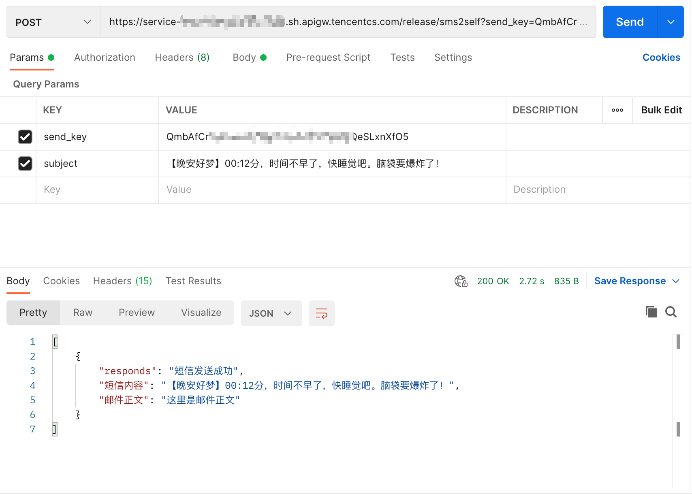

# 给自己发短信
原理: 电信和联通 有189邮箱和沃邮箱。可以设置新邮件短信提醒。

短信内容包含邮件的主题。可以通过这一点做一点文章。

# 效果：

# Quick Start

1. 注册https://console.cloud.tencent.com/scf/list

2. 新建函数服务
3. 上传zip包
4. 配置环境变量下面5个

|key|value|
|:---:|:---:|
|my_sender|发件邮箱|
|my_pass|发件邮箱密码(可能是专用密码)|
|smtp_server|发件邮箱|
|my_user|收件人(运营商邮箱)|
|send_key|发送密码，需要自定义|

5. 创建触发器：API网关触发
请求方法：ANY

6. 得到一个api地址：https://xxx.sh.apigw.tencentcs.com/release/sms2self

请求方式支持post和get
请求头里发送send_key和subject
body中内容即邮件正文

